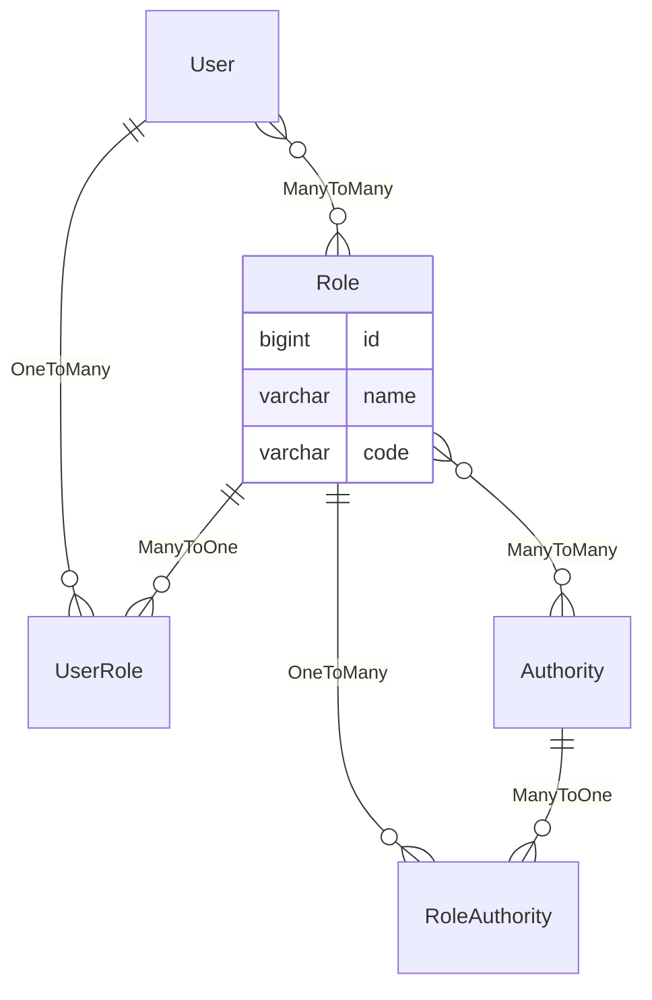

角色
====

角色是一系列权限组合，可以简化授权逻辑。

---

## 设计思路

根据 [1.1.安全](1.01.security) 章节，授权需要给用户添加权限，但逐个添加显然不现实。

于是可以设计一个角色表，包含权限列表字段，用户需要哪些权限，直接添加对应角色即可。

如果角色中的权限列表不符合预期，也可以新建角色并添加相关权限。

## 数据建模

### 角色表

- id：角色 ID
- name：角色名称
- code：角色代码

**注意：`User`表和`Authority`表在这里只是一个虚拟表，分别代表用户和权限。**
