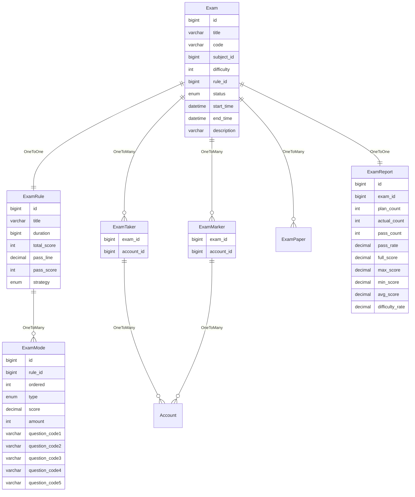
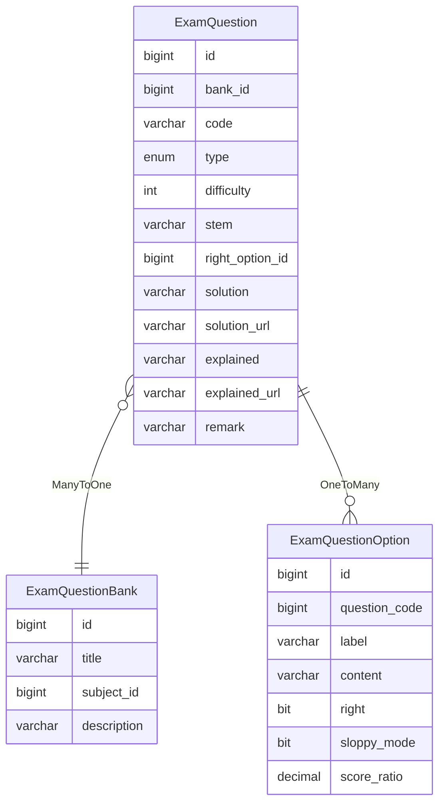
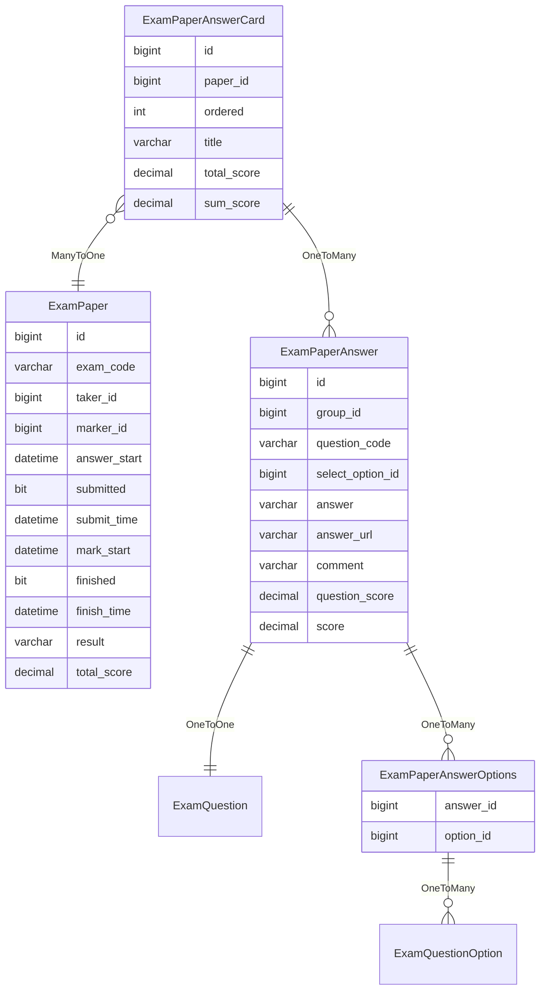

考试
====

在线考试系统的核心功能就是考试。

---

## 设计思路

创建指定日期时间的考试时，可以选择对应科目和考试规则，并支持添加考生和阅卷人。

准备考试时，将根据对应科目和考试规则从题库抽取试题，组成对应考生和阅卷人的试卷。

考试开始之后，考生通过当前考试拿到自己的试卷，于考试时间内进行作答。

作答完毕，主动提交试卷，或考试时间到期时自动提交试卷，表示结束考试。

考试结束后，阅卷人可以在线阅卷，部分试题如果支持自动阅卷，将在试卷提交时自动给出成绩。

阅卷完毕后，考生通过考试详情，查询考试成绩。

另外，如果时间允许的话，可以进行考情分析，给出相关数据。

### 考情分析

考情分析是根据各科目的考试成绩，反映考生的整体水平和各科目的难易程度。

一般来说，考情分析可以包括以下几个指标：

- 最高分：反映考生的最高水平和最佳表现。
- 最低分：反映考生的最低水平和最差表现。
- 平均分：反映考生的平均水平和总体表现。
- 及格率：反映考生达到基本要求的比例。
- 难度系数：反映试题的难易程度，一般用平均分除以满分。

## 数据建模

### 考试相关

考试：包含标题、编码、科目、难度、规则、模式列表、试卷、状态、开始时间、结束时间、描述、考生名单、阅卷人名单等。

- 标题：通过选择相关参数自动生成标题。支持手动修改。
- 编码：通过选择相关参数自动生成编码。唯一，不支持修改。
- 科目：可以分为语文、数学、英语等教育类科目，也可以分为计算机、金融、保险等行业类科目。
- 难度：用于匹配试题难度，通常是 1--5 星，其中 1 星最简单，5 星最难。
- 规则：标题、考试时长、总分数、合格线、合格分数、模式策略、模式列表。
  - 标题：考试规则的标题。 
  - 考试时长：自考试开始时间起，考试持续的时长。由此可以计算考试结束时间。
  - 总分数：本场考试的总分数。
  - 合格线：合格分数占总分数的比例。通常是两位小数，表示百分比。
  - 合格分数：大于等于合格分数，即为考试合格。通常由合格线乘以总分数计算得出。
  - 模式策略：
    - 随机：即根据科目、难度、类型、分值等数据，随机从题库抽取指定题量的试题。
    - 匹配：即根据科目、难度、类型、分值等数据，从题库抽取最佳匹配试题——通常排序后根题量获取试题。
    - 固定：即直接指定试题代码，表示组成固定试题的试卷。
  - 模式列表：模式包含顺序、题型、分值、题量、试题代码（可选，对应规则的策略为固定时可用）。
    - 顺序：表示组成试卷时的排列顺序，比如第一题、第二题等。
    - 题型：
      - 客观题——判断、单选、多选等。
      - 主观题——填空、计算、简答、论述、分析、写作等。
    - 分值：即抽取的试题所能获得的最大分数，可以直接填写，也可以根据难度进行计算。
    - 题量：表示其需要抽取的试题数量。
    - 试题代码1--5：当策略为固定时，可指定试题代码，表示从题库直接获取对应试题进行组卷。
- 状态：默认、待开始、考试中、阅卷中、已完成、考试暂停、阅卷暂停。
- 开始时间：包含日期和时间，在开始时间与结束时间范围内进行作答。考试开始后，不可再修改考试时间。
- 结束时间：通常由规则中的考试时长计算得出，也支持手动调整。
- 描述：对本次考试的描述，可以是注意事项，或其他补充信息。
- 考生名单：参与本次考试的人员列表。
- 阅卷人名单：参与本次阅卷的人员列表。
- 试卷列表：做考试准备时，将根据对应数据生成试卷列表。
- 考试报告：考试结束后，生成的考试报告。

### 题库相关

题库：包含标题、科目、描述和试题列表。

- 标题：题库的名称。
- 科目：与考试科目进行匹配。
- 描述：题库的详细介绍。
- 试题列表：试题包含编码、题型、难度、题干、选项列表、正确选项、答案、答案URL、解析、解析URL、备注。
  - 编码：根据题型、创建时间、题库科目等参数生成。
  - 题型：与考试模式题型进行匹配。
  - 难度：与考试难度进行匹配。
  - 题干：一般是一个问题或一个不完整的句子，要求考试人员从选项中选择正确答案，或者给出自己的答案。
  - 选项列表：对于主观题，提供相关选项；通常由标签、内容、是否正确答案、是否宽松模式、分值占比等组成。
    - 标签：选项的文字标签，比如 A、B、C、D 之类的。
    - 内容：选项的内容。
    - 是否正确答案：表示当前选项为正确答案。
    - 是否宽松模式：默认不开启，需要全选对才计分；多选题可以开启此模式，表示未选择错误答案时，将已选答案的分值占比乘以试题分数，进行统计求和。
    - 分值占比：当前选项的分值占试题分数的比例。
  - 正确选项：单选题或判断题的正确选项。
  - 答案：通常是文本，主观题的参考答案示例，或多选题的正确选项标签（按自然顺序排列）。
  - 答案URL：通常是图片URL，主观题的参考答案示例。
  - 解析：通常是文本，客观题的答案解析，或主观题的解题思路。
  - 解析URL：通常是图片URL，客观题的答案解析，或主观题的解题思路。
  - 备注：对题干进行补充说明。

### 试卷相关

试卷：包含答题卡列表、答题开始时间、是否提交、提交时间、阅卷开始时间、是否完成、完成时间、结果、总得分。

- 答题卡列表：答题卡包含答题列表、顺序、标题、总分数、得分和
  - 答题列表：答题包含试题编码、单选选项、多选选项、答题内容、答题链接、阅卷批注、试题得分。
    - 试题编码：即试卷包含的试题，通过编码一一对应。
    - 单选选项：即判断题或单选题的某一选项。
    - 多选选项：即多选题的选项列表。
    - 答题内容：代表对主观题的回答文字。
    - 答题链接：通常是对主观题的回答的图片链接。
    - 阅卷批注：代表阅卷人员对答题内容的批注，用于审查阅卷人员是否按照有关规定进行批阅试卷。
    - 试题分数：表示当前试题可得最大分数。
    - 获得分数：通常客观题自动计算得分，主观题由阅卷人员打分。
  - 顺序：表示大题顺序。
  - 标题：通常是试题列表的题型名称，或者自定义一个标题。
  - 总分数：表示大题分数，即试题列表中的试题分数和。
  - 得分和：表示大题中的试题列表获得分数和。
- 作答开始时间：考试人员首次进入考试的时间。
- 是否提交：提交试卷后，不可再对试卷进行作答；考试时间截止后，自动提交试卷。
- 提交时间：提交试卷的时间。
- 阅卷开始时间：阅卷人员首次进入已作答试卷的时间。
- 是否完成：完成阅卷后，不可再对试卷进行批阅，除非由管理员修改状态。
- 完成时间：完成阅卷的时间。
- 结果：完成阅卷时，根据答题列表及相关模版，生成的成绩总结。
- 总得分：考试人员在当前试卷中所有试题的分数和。
