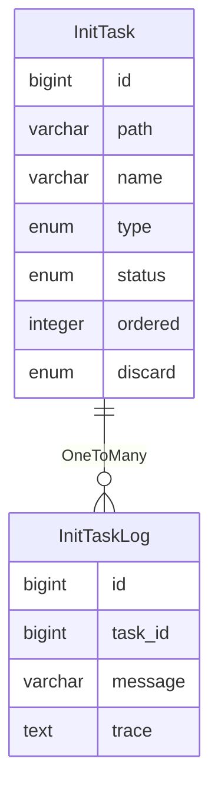

初始化
=====

初始化是在系统启动时，从数据库搜索初始化任务并根据状态判断是否执行。

---

## 设计思路

初始化类型：

1. 系统初始化：必选的初始化任务，每次在系统启动时，判断执行状态，如果未执行，则自动执行一次
2. 自定义初始化：可选的初始化任务，通过管理后台手动执行，用于填充用户相关的数据，也可以视为重置系统

初始化事项：

1. 初始化执行顺序登记：编排初始化接口实现类的执行顺序，确保所有初始化任务得到正确执行
2. 初始化同步运行器：从`Spring`容器扫描`Initializer`接口实现类的实例，转为初始化任务并同步到数据库
3. 初始化任务运行器：执行未完成的初始化任务，保证开箱即用
4. 自定义初始化实现：支持管理员进入后台管理系统，勾选自定义类型，提交任务到队列执行初始化任务
5. 初始化任务日志：对初始化任务的执行情况进行记录，用于回溯历史和审计

## 数据建模

### 初始化任务

- `path`路径：初始化任务实现类的全限定名称，用于保证每个初始化任务的唯一性
- `name`名称：通常是实现类的简单类名，作为显示的后备字段，实际上会从国际化文件中通过路径寻找对应语言标签的名称
- `type`任务类型：系统类型，系统启动时自动执行；自定义类型，可通过后台管理决定是否执行
- `status`任务状态：记录初始化任务的相关状态，避免系统启动时重复执行
- `ordered`顺序：保证系统初始化任务按照设定的顺序执行
- `discard`是否废弃：如果初始化任务已删除，但忘记清理数据库，则标记为废弃

### 初始化任务记录

- `task_id`任务编号：任务与记录为一对多关系
- `message`消息：执行成功或者失败
- `trace`踪迹：如果失败，则记录异常堆栈

## 扩展思路

自定义初始化任务的执行方式：

1. 通过`JS`脚本执行已有的系统服务
2. 通过`Groovy`脚本执行已有的系统服务
