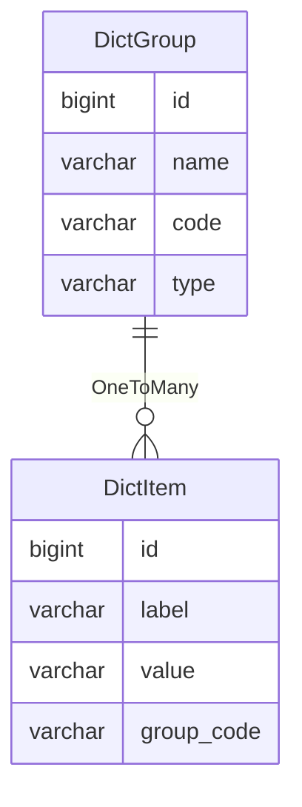

字典
====

字典是关于系统中数据的描述，是系统的基础。

在系统中，字典可以用来存储和管理一些常用的键值对，例如状态码，枚举值，配置参数等。

字典可以提高系统的可维护性、可读性和安全性。

---

## 设计思路

可以设计三种类型的字典：

1. 内置字典：通常是枚举类，一般情况下不会修改和删除枚举类，系统启动时扫描并同步到数据库
2. 自定义字典：通常持久化到数据库，支持运行时修改，通过管理后台进行增删改查
3. `Excel`字典：通常的数据源是从网络收集的资料，类似内置字典的规则，在每次启动时同步到数据库

### 内置字典

首先，假设字典存储在数据库中，则全新环境下的首次启动，数据库不存在任何字典数据，那么将无法判断初始化任务的相关状态。

为此，我们设计一些特殊的枚举作为内置字典，再通过`JPA`实体使得字典引用字段具有强约束性，从而保证系统的稳定性。

对于内置字典，需要在系统启动时自动执行检测：

1. 扫描指定包下面的所有枚举类，得到字典枚举列表
2. 遍历所有字典枚举，查看数据库是否存在对应字典组，不存在则创建，已存在则获取组内的所有字典项
3. 通过字典枚举的值对比字典项，不存在则创建，已存在则更新

**注意：通过`Spring Data REST`框架可以将枚举值解析为`i18n`国际化消息，从而使得内置字典支持国际化。**

**扩展：可以增加一个配置项，用来加载其他路径下的枚举，从而扩大内置字典的数据量。**

### 自定义字典

内置字典无法满足日新月异的业务需求，并且每添加一个字典枚举，都需要发布一次版本，非常不灵活，所以必须增加自定义字典。

自定义字典通过后台手动维护，即支持新增、编辑和删除操作，数据与内置字典存放在同一张表内。

**注意：自定义字典通常无需支持`i18n`国际化，由用户自行设定相关内容。**

### Excel 字典

并不是所有的字典都需要一个枚举类，所以我们又设计来自`Excel`文件的字典数据。

`Excel`字典可以单独建表保存数据，比如省市县数据，国家地区数据，法定节假日数据等等。

它是介于内置字典和自定义字典之间的一种类型，即数据从`classpath:resources/data/`目录下初始化，支持增删改查操作，属于独立的功能模块。

## 数据建模

想象一下，当用户填写资料时，需要从下拉框选择性别：男、女，这将包含三个要素，性别分类，男和女的名称，以及它们对应的值。

我们可以通过`code=gender`参数作为分类，获取到`未知[UNKNOWN]`、`男[MALE]`、`女[FEMALE]`这三条字典。

其中，前面是名称，用于前端展示，后面的中括号是值，用于逻辑判断。

通常的设计方案，是将字典拆分为两张表：字典组和字典项。

字典组存放的是字典分类，方便建立唯一约束，字典项则存放字典数据，支持不同分类下拥有相同值的情况。

### 字典组表

- `name`名称：用于页面展示，最大长度不超过 100 字符
- `code`代码：用于查找，必须保证唯一，最大长度不超过 50 字符
- `type`类型：区分字典来源
    - `INTERNAL`内置类型：通过扫描指定位置的枚举类生成
    - `EXCEL`Excel类型：通过扫描指定位置的`Excel`文件生成
    - `CUSTOM`自定义类型：通过系统后台手动创建

### 字典项表

- `label`标签：用于页面展示，最大长度不超过 100 字符
- `value`值：用于确定指定字典组下的唯一性，最大长度不超过 50 字符
- `group_code`字典组代码：即`DictGroup`中的`code`字段，最大长度不超过 50 字符

## 扩展讨论

扩展讨论一些事项，比如：为什么不按照国际标准 [ISO][1] 来实现字典等问题。

### 人类性别

根据 [ISO 5218][2] 标准规定，人类性别分为：

- 未知：`0`
- 男：`1`
- 女：`2`
- 未规定项（未指明）：`9`

通过`JPA`我们可以将枚举以枚举值顺序或者枚举值名称的形式存储到数据库，来保证枚举字典与数据字典的一致性。

本系统不采用枚举值顺序的方式，因为它可能涉及代码位置的调整，从而导致枚举字典与数据字典的匹配异常。

采用枚举值名称的形式，可能无法实现 [ISO 5218][2] 标准，因为枚举值名称不允许出现纯数字。

如果在枚举中提供名为`code`的字符串属性，设置默认的数字代码，又将涉及到国际化以及代码转换的问题，可能导致开发变得复杂。

因此，本系统为了避免以上问题，采用英文单词作为性别枚举的枚举值名称，并以字符串形式存储到数据库。

对于国际化与代码转换，直接使用已有框架进行处理，不需要进行额外的处理。

[1]:https://zh.wikipedia.org/wiki/%E5%9C%8B%E9%9A%9B%E6%A8%99%E6%BA%96%E5%8C%96%E7%B5%84%E7%B9%94#%E9%83%A8%E4%BB%BD%E5%9C%8B%E9%9A%9B%E6%A8%99%E6%BA%96%E5%88%97%E8%A1%A8
[2]:https://zh.wikipedia.org/wiki/ISO_5218