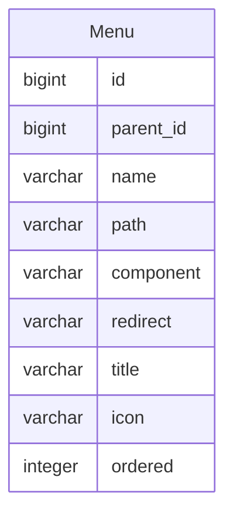

菜单
====

在前后端分离的设计中，菜单实际上是前端的路由数据，不同的用户可能拥有不同的路由数据，并在登录成功时动态加载。

---

## 设计思路

菜单需要支持嵌套，即顶级菜单下，可以存在子级菜单，这些子级菜单也可以包含其他子级菜单，通常嵌套不超过三级。

## 数据建模

- id：菜单ID
- parent_id：上级菜单ID，非必填，若为 null 则表示顶级菜单
- name：名称，必填
- path：路径，必填
- component：前端组件名称或路径，必填，导入时需要
- redirect：重定向，非必填，通常为第一个子级菜单的路径
- title：前端组件名称或路径，必填，导入时需要
- icon：图标，非必填
- ordered：排序，非必填，如果不填写则根据创建时间排序
