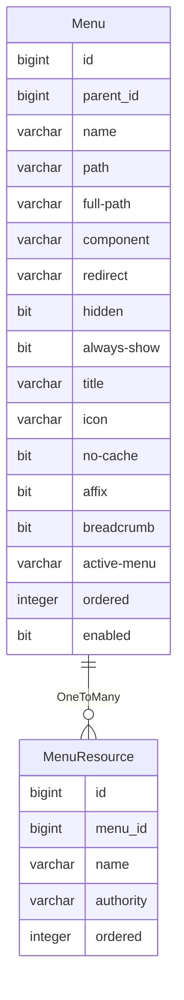

菜单
====

从后端加载菜单数据，并渲染为路由，前端通过路由跳转到不同页面。

---

## 设计思路

菜单需要支持嵌套，即顶级菜单下，可以存在子级菜单，这些子级菜单也可以包含其他子级菜单，通常嵌套不超过三级。

通过观察`vue-element-admin`的路由设计，可以发现其遵循`Vue`的路由设计之外，在`meta`中还额外添加了一些信息，比如标题、图标以及角色等。

路由中的角色实际上只是一种权限标识符，代表用户可以访问此菜单。

除了角色外，对于`meta`中的其他数据，都可以存放在菜单表中，查询时直接返回即可。

访问最下级的菜单将展示一个页面，页面中包含各种按钮，比如弹窗按钮、提交按钮、删除按钮等，这些按钮统称为菜单资源。

菜单与菜单资源是一对多的关系，菜单资源包含名称、权限等字段，实际上也是提供给前端的权限标识符，前端页面需要检测这些权限标识符。

如果菜单资源需要访问后端接口，必须将权限标识符通过`@PreAuthorize`注解硬编码到接口方法上。

由于

## 数据建模

### 菜单

- id：菜单 ID
- parent_id：上级菜单 ID，若为 null 则表示顶级菜单，非必填
- name：路由名称，用于 <keep-alive>，必填
- path：路径，浏览器的 URL 地址，必填
- full-path：完整路径，根据上级路径补全的完整路径，必填
- component：前端的组件名称或组件路径，导入页面时需要，必填
- redirect：重定向，通常为第一个子级菜单的完整路径，当设置为 noRedirect 时，将无法从面包屑中跳转到当前菜单，非必填
- hidden: 是否隐藏，如果设置为 true 将不在侧边栏展示，默认为 false
- always-show: 是否始终显示，如果设置为 ture，将始终显示在主菜单上，无论是否存在子菜单。如果未设置此项，则超过一个子菜单时，以嵌套方式展示，否则隐藏（如果存在一个子菜单，则显示这个子菜单）
- title：展示在侧边栏以及面包屑的标题，必填
- icon：展示在侧边栏的图标，非必填
- no-cache：如果设置为 true，页面将不会被缓存，默认为 false
- affix：固定，如果设置为 true 则在 TAG 中固定，非必填
- breadcrumb：面包屑，如果设置为 false 则在面包屑中隐藏，默认为 true
- active-menu：活动菜单，如果设置了路径，则在侧边栏高亮这个路径，非必填
- ordered：排序，如果不填写则根据创建时间排序，非必填
- enabled：启用，只有启用的菜单才会返回给前端，默认为 true

### 菜单资源

- id：菜单资源 ID
- menu_id：所属菜单 ID
- name：菜单资源名称，必填
- authority：菜单资源权限，必填
- ordered：菜单资源排序，非必填
