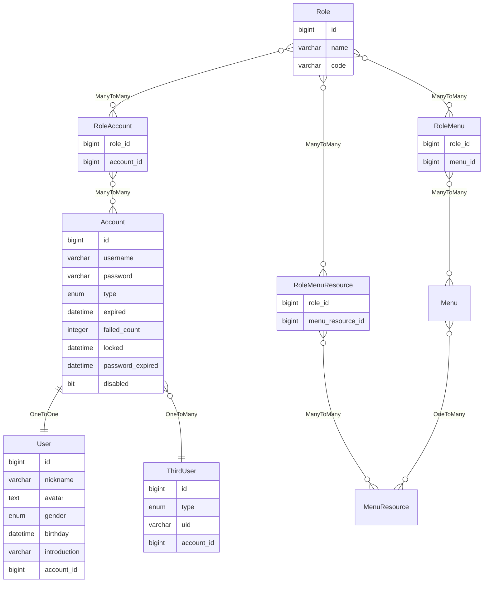

账户
====

账户是系统的核心，需要提供认证和授权相关的用户信息。

---

## 设计思路

认证和授权相关的用户信息，需要实现`UserDetails`接口，包含权限列表、密码、用户名、账户是否未过期、账户是否未锁定、密码是否未过期以及账户是否启用这几项。

权限列表实际上包含账户的完整权限，又分为角色权限和接口权限两种，角色权限可以用账户类型转换，接口权限则来自菜单资源。

账户类型用来区分游客、用户和管理员，通常后者包含前者的所有权限。

一个菜单可能对应一个页面，页面中包含多个接口资源，一个接口资源对应一个接口权限。

非公开的接口需要授权才能访问，账户必须拥有相关接口资源，也就是说，账户的权限列表中必须包含对应接口权限。

认证通常使用用户名和密码来完成，也支持其他方式，比如第三方认证、`LDAP`、`CAS`等，由于这些不是本系统的核心功能，此处不再展开讨论。

密码采用随机加盐的不可逆编码方式进行加密，以此保证账户安全。用户名是系统中的唯一标识符，标志着独一无二的账户。

账户是否未过期属于安全要求比较高的系统，通常是每三个月或者半年需要续期一次，如果忘记续期将导致账户过期，后续无法认证成功。

账户是否未锁定主要是防止暴力破解密码，如果失败次数超过某个阈值，则会在一段时间内锁定账户，此时无法进行认证，直到锁定时间过期。

密码是否未过期也是一种注重安全的措施，定期修改密码有利于保护账户安全。

账户是否启用相当于一个开关，可以在账户注册时，可以发一封激活邮件，点击邮件链接即可启用账户。如果要禁用账户，则必须找到对应会话使其无效。

非安全相关的用户信息通常包含昵称、头像、性别、生日、电子邮箱、电话号码以及简介等字段。

另外，通过第三方平台注册时，需要生成本系统的账户和用户信息，同时将第三方平台用户信息保存，并建立与账户的多对一关系。

最后，根据 [1.1.security](1.1.security.md) 章节，可以建立角色多对多账户、角色多对多菜单、角色多对多菜单资源的权限体系。

## 数据建模

### 账户

- username：用户名，必填，唯一，不可修改，最小长度 4 个字符，最大长度 24 个字符，必须为全小写字母，且以字母开头，数字或字母结尾，不包含特殊字符（第三方平台注册的用户名允许包含 _ 符号）
- password：密码，必填，明文时最小长度 6 个字符，最大长度 64 个字符，支持任意字符
- type：类型，默认为用户类型，可以修改为游客、管理员等等
- expired：账户失效期限，未设置表示永久有效，否则将在指定日期之后失效
- failed_count：失败次数统计，账户未锁定时，统计次数，当次数超过设定的阈值时，将锁定账户一段时间
- locked：锁定时间戳，未设置表示账户未锁定，否则将在指定日期之内锁定
- password_expired：密码失效期限，未设置表示永久有效，否则将在指定日期之后失效
- disabled：是否禁用，默认为未禁用，即启用状态

### 用户信息

- nickname：昵称，必填，为避免昵称过长，限制为 16 个字符
- avatar：头像，非必填，这是一个 URL 地址
- gender：性别，默认为未知性别，表示用户不展示真实性别，此时若未设置头像，则使用男性默认头像
- birthday：生日，通过生日可以计算实时年龄
- email：电子邮件
- phone_number：电话号码
- introduction：简介，即个性签名之类的介绍
- account_id：所属账户 ID

### 第三方用户

- type：第三方用户类型，必填，标识第三方平台
- uid：统一标识符，必填，确保第三方平台用户绑定用户信息
- account_id：绑定的账户 ID

### 角色

- name：角色名称，唯一，必填，最大长度 24 个字符
- code：角色代码，唯一，必填，最大长度 48 个字符

### 角色账户

- role_id：角色 ID
- account_id：账户 ID

### 角色菜单

- role_id：角色 ID
- menu_id：菜单 ID

### 角色菜单资源

- role_id：角色 ID
- menu_resource_id：菜单资源 ID

### 菜单及菜单资源

请参考 [菜单](1.6.menu.md) 章节。