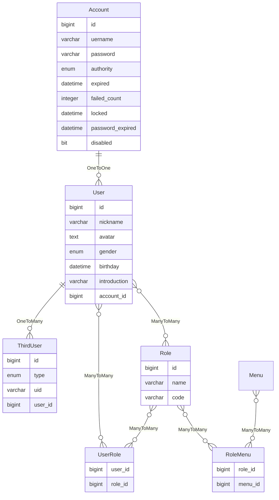

账户
====

账户通常用来进行系统认证和授权，包含用户名、密码以及认证和授权相关的信息。

---

## 设计思路

用户名是系统中的唯一标识符，标志着独一无二的账户。

密码采用随机加盐的不可逆编码方式进行加密，以此保证账户安全。

权限字段表示匿名人员、用户和管理员角色，实际上是在划分账户类型。

认证和授权相关的信息需要实现`UserDetails`接口，主要包含权限列表、账户是否未过期、账户是否未锁定、密码是否未过期以及账户是否启用这几项。

用户资料通常包含昵称、头像、性别、生日以及简介等信息。

另外，第三方平台的用户在注册时，需要生成对应的账户以及用户资料，同时将第三方平台用户数据保存下来，建立与账户的单向多对一关系。

为了保持账户的纯粹性——主要登录成功后，账户会在`HttpSession`中存储——为了避免臃肿，账户实体中不再包含其他实体的字段。

最后，根据 [1.1.security](1.1.security.md) 的设计，需要在账户与菜单数据之间，建立一个角色体系，用户多对多角色，角色多对多菜单数据。

这样既保证了账户的纯粹性，也能够通过账户查询用户对应的角色，通过角色查询相关菜单数据，从而获得账户的完整授权数据。

## 数据建模

### 账户

- username：用户名，必填，唯一，不可修改，最小长度 4 个字符，最大长度 24 个字符，必须为全小写字母，且以字母开头，数字或字母结尾，不包含特殊字符（第三方平台注册的用户名允许包含 _ 符号）
- password：密码，必填，明文时最小长度 6 个字符，最大长度 64 个字符，支持任意字符
- authority：权限，默认为用户角色
- expired：账户失效期限，未设置表示永久有效，否则将在指定日期之后失效
- failed_count：失败次数统计，账户未锁定时，统计次数，当次数超过设定的阈值时，将锁定账户一段时间
- locked：锁定时间戳，未设置表示账户未锁定，否则将在指定日期之内锁定
- password_expired：密码失效期限，未设置表示永久有效，否则将在指定日期之后失效
- disabled：是否禁用，默认为未禁用，即启用状态

### 用户资料

- nickname：昵称，必填，为避免昵称过长，限制为 16 个字符
- avatar：头像，非必填，这是一个 URL 地址
- gender：性别，默认为未知性别，表示用户不展示真实性别，此时若未设置头像，则使用男性默认头像
- birthday：生日，通过生日可以计算实时年龄
- introduction：简介，即个性签名之类的介绍
- account_id：所属账户 ID

### 第三方用户

- type：第三方用户类型，必填，标识第三方平台
- uid：统一标识符，必填，确保第三方平台用户绑定用户资料
- user_id：用户 ID

### 角色

- name：角色名称，唯一，必填，最大长度 24 个字符
- code：角色代码，唯一，必填，最大长度 48 个字符

### 用户角色

- user_id：用户 ID
- role_id：角色 ID

### 角色菜单

- role_id：角色 ID
- menu_id：菜单 ID
