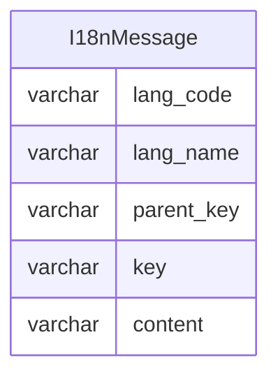

国际化
=====

国际化要实现的效果是，系统根据不同的语言标签，显示不同的消息内容。

一般分为前端国际化和后端国际化，其中前端国际化包含页面、菜单、按钮以及相关文本，后端国际化包含响应消息以及相关数据。

语言标签是由`ISO 639-1`规范中定义的语言代码，加上`ISO 3166`规范中定义的国家/地区代码组成，比如简体中文就是`zh_CN`语言标签。

对于前端国际化的实现，通常是在代码中预定义消息内容，同时也支持从后端加载更多语言标签对应的消息内容。

对于后端国际化，一般包含以下两种实现：

- 系统消息国际化：是指后端接口返回给前端时，对于系统内置的消息内容需要支持国际化，比如登录失败时返回的消息内容。
- 自定义消息国际化：是指后端管理的国际化消息内容，支持自定义编辑，主要用于前端初始化时加载国际化消息内容。

*提示：`Java`自带的`Locale#getAvailableLocales`可以获取`JVM`支持的所有语言标签，适合用来初始化数据字典，避免鸡生蛋、蛋生鸡的问题。*

---

## 设计思路

对于系统消息国际化，我们可以使用`Spring Framework`自带的[国际化功能][1]。

简单来说，每一种语言标签对应一份`message[lang-code].propeties`文件，这些文件存放在`resources`目录下，文件中的每个`key`对应一条`content`消息内容，为了保证消息内容没有歧义，`key`键名不允许重复。

识别当前语言标签的方式是，在每次访问接口时，如果在请求的`Header`中发现`Accept-Language`存在语言标签列表，则`ServletRequest`的`getLocale`方法会获取到首选语言标签，从而在当前线程上下文中，将默认语言标签切换到指定语言标签，随后进行的一系列处理都将基于此语言标签。

对于国际化资源文件，需要注意`Spring Security`和`Spring Data REST`这两个框架的区别：

- `Spring Security`框架需要声明`spring.messages.basename=org.springframework.security.messages`配置项
- `Spring Data REST`框架则是固定的`classpath:rest-message[lang-code].properties`文件

如果需要扩展系统消息国际化，则需要创建名为`message[lang-code].properties`的文件，并和`Spring Security`框架一样，指定`spring.messages.basename=messages,org.springframework.security.messages`配置项，其中使用逗号分割国际化消息的文件名称。

对于自定义消息国际化，我们需要考虑一种数据结构，用于保存语言标签以及对应的国际化消息数据。

## 数据建模

这里仅针对自定义消息国际化进行数据建模。

首先根据前端模板 `vue-element-admin` 的国际化功能，我们看到一个典型的国际化消息文件：

```js
export default {
    // 此处省略内容...
    navbar: {
        dashboard: '首页',
        github: '项目地址',
        logOut: '退出登录',
        profile: '个人中心',
        theme: '换肤',
        size: '布局大小'
    },
    login: {
        title: '系统登录',
        logIn: '登录',
        username: '账号',
        password: '密码',
        any: '随便填',
        thirdparty: '第三方登录',
        thirdpartyTips: '本地不能模拟，请结合自己业务进行模拟！！！'
    },
    // 此处省略内容...
}
```

由上面的内容可以简单设计出国际化功能的数据结构：



### 国际化消息

- `lang_code` 语言标签代码：通常来自 `Locale#getAvailableLocales` 方法返回的数据
- `lang_name` 【可选】语言标签名称：用来表示语言标签代码的文字，通常是使用者的母语
- `parent_key` 父键名：表示当前消息属于特定某个分类
- `key` 键名：用来确定消息的唯一性，但通常我们不建立唯一索引，因为不同的 `lang_code` 有相同的 `key` 键名
- `content` 消息内容：表示 `key` 对应的消息内容，通常与 `lang_code` 有关，比如 `zh_CN` 表示中文消息内容

[1]:https://docs.spring.io/spring-boot/docs/2.7.10/reference/html/features.html#features.internationalization