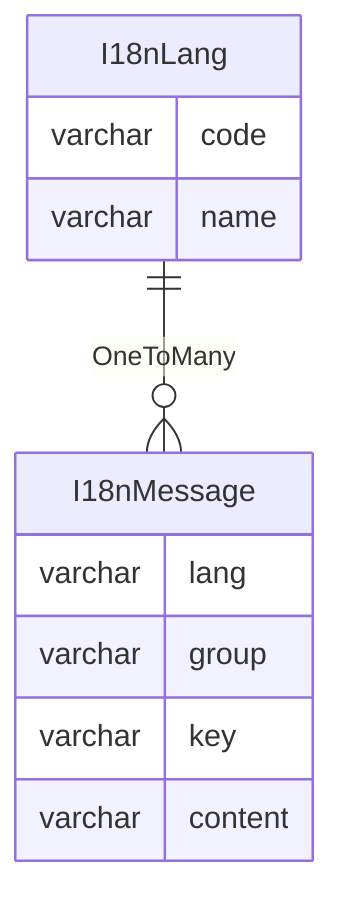

国际化
=====

国际化是指系统根据语言标签显示不同的消息内容，分为前端国际化与后端国际化两种类型。

语言标签是由 `ISO 639-1` 规范中定义的语言代码加上 `ISO 3166` 规范中定义的国家/地区代码组成，比如简体中文就是 `zh_CN`
语言标签。

对于前端国际化的实现，通常是在代码中使用母语预定义消息内容，同时也支持通过相关 `API` 加载更多语言标签对应的消息内容。

对于后端国际化，一般包含以下两种实现：

- 系统消息国际化：是指后端接口返回给前端时，对于系统内置的消息内容需要支持国际化，比如登录失败时返回的消息内容。
- 自定义消息国际化：是指后端管理的国际化消息内容，支持自定义编辑，主要用于前端初始化时加载国际化消息内容。

*提示：`Java` 自带的 `Locale#getAvailableLocales` 可以获取 `JVM` 支持的所有语言标签。*

---

## 设计思路

对于系统消息国际化，我们可以使用 `Spring Framework` 框架自带的[国际化功能][1]，它是在资源文件中使用相关 `key`
键名映射 `content` 消息内容，不同的语言标签对应不同的 `message[lang-code].propeties` 文件。

在 `Spring MVC` 中，当接口被访问时，如果在请求的 `Header` 中发现 `Accept-Language` 存在语言标签列表，则 `ServletRequest`
的 `getLocale`
方法会获取到首选语言标签，从而在当前线程上下文中，将默认语言标签切换到指定语言标签，随后进行的一系列处理都将基于此语言标签。比如在解析国际化消息内容时，会自动从当前线程上下文获取语言标签，并匹配对应国际化消息文件。

需要注意 `Spring Security` 和 `Spring Data REST` 这两个框架的区别：

- `Spring Security` 框架需要在应用程序的配置文件中声明 `spring.messages.basename=org.springframework.security.messages`
  配置项，才能在系统中生效。

- `Spring Data REST` 框架不需要指定国际化消息文件的路径，而是在固定路径（`classpath:rest-message[lang-code].properties`
  ）上，创建固定格式的国际化消息文件，才能被系统解析和使用。

如果需要扩展系统消息国际化，则需要创建名为 `message[lang-code].properties` 的文件，并和 `Spring Security`
框架一样，指定 `spring.messages.basename=messages,org.springframework.security.messages` 配置项，其中使用逗号分割国际化消息的文件名称。

对于自定义消息国际化，我们需要考虑一种数据结构，用于保存语言标签以及对应的国际化消息数据。

我们不需要在后端系统中使用自定义消息国际化，而是在前端需要的时候提供数据，因此先确定前端如何使用它们，才能进行数据建模。

## 数据建模

根据前端模板 `vue-element-admin` 的国际化功能，我们看到一个典型的国际化消息文件：

```js
export default {
    // 此处省略内容...
    navbar: {
        dashboard: '首页',
        github: '项目地址',
        logOut: '退出登录',
        profile: '个人中心',
        theme: '换肤',
        size: '布局大小'
    },
    login: {
        title: '系统登录',
        logIn: '登录',
        username: '账号',
        password: '密码',
        any: '随便填',
        thirdparty: '第三方登录',
        thirdpartyTips: '本地不能模拟，请结合自己业务进行模拟！！！'
    },
    // 此处省略内容...
}
```

由上面的内容可以简单设计出国际化功能的数据结构：



#### 国际化语言

- `code` 语言标签代码：通常来自 `Locale#getAvailableLocales` 方法返回的数据
- `name` 语言标签名称：通常和代码保持一致

#### 国际化消息

- `lang` 消息语言标签：即 `I18nLang` 对应的代码，表示消息属于某一类语言
- `group` 消息分组：用来表示消息的分组，即上面典型国际化消息文件的 `navbar` 和 `login` 字符串
- `key` 消息键名：用来确定消息的唯一性，但通常我们不建立唯一索引，因为不同的 `lang` 语言可以对应相同的 `key` 键名
- `content` 消息内容：表示 `key` 对应的消息内容，通常与 `lang` 有关，比如 `zh_CN` 表示中文消息内容

## 功能清单

- [ ] 分页查询国际化语言标签列表
- [ ] 新增国际化语言标签
- [ ] 修改国际化语言标签
- [ ] 删除国际化语言标签
- [ ] 分页查询国际化消息列表
- [ ] 根据语言标签查询国际化消息列表
- [ ] 新增国际化消息列表
- [ ] 修改国际化消息列表
- [ ] 删除国际化消息列表

[1]:https://docs.spring.io/spring-boot/docs/2.7.10/reference/html/features.html#features.internationalization