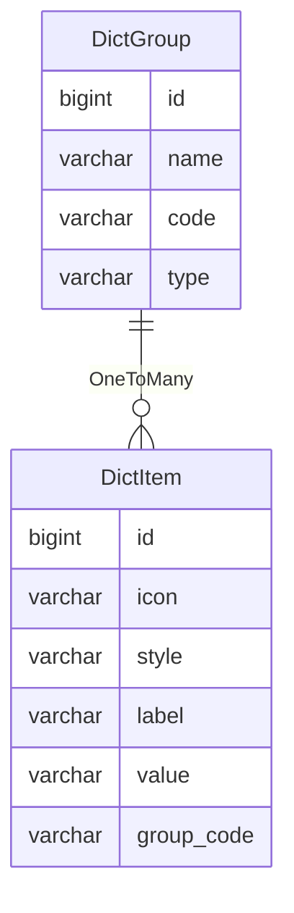

字典
====

字典是全局常量，在运行期间需要保持稳定不变，而对于一些特殊情况，也具备相应的灵活性。

---

## 设计思路

可以设计三种类型的字典：

1. 内置字典：通常是枚举类，一般情况下不会修改和删除，每次在系统启动时扫描并同步到数据库
2. Excel 字典：通常的数据源是从网络收集的资料，类似内置字典的规则，在每次启动时同步到数据库
3. 自定义字典：通常持久化到数据库，支持运行时修改，通过管理后台进行增删改查

### 内置字典

首先，假设字典存储在数据库中，则全新环境下的首次启动，数据库不存在任何字典数据，那么将无法判断初始化任务的相关状态。

为此，我们设计一些特殊的枚举作为内置字典，再通过 JPA 实体使得字典引用字段具有强约束性，从而保证系统的稳定性。

对于内置字典，需要在系统启动时自动执行检测：

1. 扫描指定包下面的所有枚举类，得到字典枚举列表
2. 遍历所有字典枚举，查看数据库是否存在对应字典组，不存在则创建，已存在则获取组内的所有字典项
3. 通过字典枚举的值对比字典项，不存在则创建，已存在则更新

通常对于不属于字典枚举的内置字典数据，我们不执行删除操作，而是由系统管理员进行维护。

**注意：通过 Spring Data REST 框架可以将枚举值解析为 i18n 国际化消息，从而使得内置字典支持国际化。**

### Excel 字典

并不是所有的字典都需要一个枚举类，所以我们又设计来自 Excel 文件的字典数据。

对于 Excel 字典，规则与内置字典相似，唯一的不同是数据源来自 `classpath:resources/data/` 目录。 

### 自定义字典

内置字典无法满足日新月异的业务需求，并且每添加一个字典枚举，都需要发布一次版本，非常不灵活，所以必须增加自定义字典。

所谓的自定义字典，通常保存在数据库中，可以通过 JPA 实体关系进行引用，在开启查询缓存的前提下，根本无需额外设计字典的热缓存。

**注意：自定义字典通常无需支持 i18n 国际化，由系统用户自行管理相关内容。**

## 数据建模

想象一下，当用户填写资料时，需要从下拉框选择性别：男、女，这将包含三个要素，性别分类，男和女的名称，以及它们对应的值。

我们可以通过 `code=gender` 参数作为分类，获取到 `未知[UNKNOWN]`、`男[MALE]`、`女[FEMALE]` 这三条字典。

其中，前面是名称，用于前端展示，后面的中括号是值，用于逻辑判断。

通常的设计方案，是将字典拆分为两张表：字典组和字典项。

字典组存放的是字典分类，方便建立唯一约束，字典项则存放字典数据，支持不同分类下拥有相同值的情况。

### 字典组

- name 名称：用于页面展示
- code 代码：用于查找，必须保证唯一
- type 类型：区分字典来源
    - INTERNAL：内置，通过扫描指定位置的枚举类生成
    - EXCEL：Excel，通过扫描指定位置的 Excel 文件生成
    - CUSTOMIZE：自定义，通过系统后台手动创建

### 字典项

- icon 图标（可选）：用于显示前端图标
- style 样式（可选）：用于显示前端样式
- label 标签：用于页面展示
- value 值：用于确定指定字典组下的唯一性
- group_code 字典组代码：即 DictGroup 中的 code 字段
