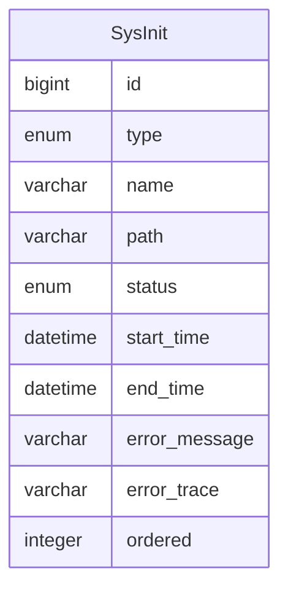

初始化
=====

初始化在系统启动时，自动更新并执行未完成的任务。

---

## 设计思路

1. 初始化检测器：扫描初始化接口的实现类，保存到数据库，记录状态
2. 初始化注册器：设定初始化任务的执行顺序，确保执行正确
3. 初始化执行器：筛选系统类型的未完成的初始化任务执行，保证开箱即用
4. 自定义初始化：管理员进入后台管理系统，勾选自定义类型，提交任务到队列执行

## 数据建模

### 系统初始化

- type 类型：系统类型，系统启动时自动执行；自定义类型，可通过后台管理决定是否执行
- name 名称：用于界面展示，屏蔽代码细节
- path 路径：初始化任务实现类的全限定名称，用于保证每个初始化任务的唯一性
- status 状态：记录初始化任务的状态，避免系统启动时重复执行
- start_time 启动时间：开始执行任务的时间戳
- end_time 结束时间：任务执行失败或执行成功的时间戳
- error_message 错误消息：抛出的异常消息
- error_trace 错误跟踪：异常类的堆栈内容
- ordered 顺序：保证初始化任务按照设定的顺序执行
