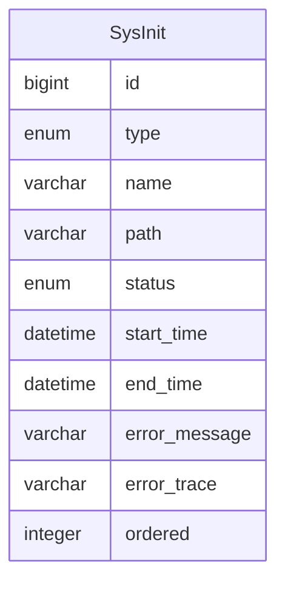

初始化
=====

初始化通常由初始化检测器在系统启动时，自动将实现类的数据加入到数据库，以记录初始化状态等信息。

随后再根据初始化类型和初始化状态，有选择的执行相关初始化任务，保证系统最低可用性，每个初始化任务仅可执行一次。

**注意：执行顺序可以通过相关注册器进行注册，对于未注册的初始化类，则以不确定顺序在已注册的初始化类之前执行。**

---

## 设计思路

系统启动时执行：

1. `AutoInitializationCheckRunner`：检测是否存在未生成的初始化数据，如果是，则生成初始化数据；否则完成检测
2. 按 `AutoInitializationOrderRegistration` 的注册顺序，执行以下自动初始化器：
    1. `SysSettingAutoInitializer`
    2. `AccountAutoInitializer`
    3. `MenuAutoInitializer`
    4. 未完待续

## 数据建模

### 系统初始化

- type 类型：必选初始化是系统启动时自动执行的初始化任务；可选初始化是由管理后台决定是否执行的初始化任务
- name 名称：用于界面展示，屏蔽代码细节
- path 路径：初始化任务实现类的全限定名称，用于保证每个初始化任务的唯一性
- status 状态：记录初始化任务的状态，避免系统启动时重复执行
- start_time 启动时间：开始执行任务的时间戳
- end_time 结束时间：任务执行失败或执行成功的时间戳
- error_message 错误消息：抛出的异常消息
- error_trace 错误跟踪：异常类的堆栈内容
- ordered 顺序：保证初始化任务按照设定的顺序执行
