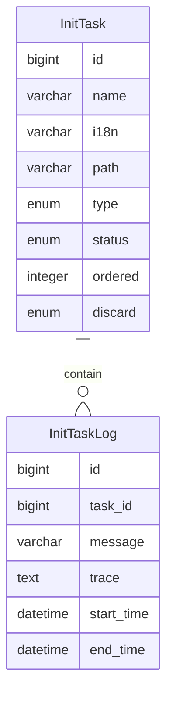

初始化
=====

表示在系统启动时，自动更新数据并执行未完成的初始化任务。

---

## 设计思路

1. 初始化检测器：扫描初始化接口的实现类，保存到数据库，记录状态
2. 初始化注册器：设定初始化任务的执行顺序，确保执行正确
3. 初始化执行器：筛选系统类型的未完成的初始化任务执行，保证开箱即用
4. 自定义初始化：管理员进入后台管理系统，勾选自定义类型，提交任务到队列执行
5. 初始化记录：每次执行都对情况进行记录，避免找不到错误原因

## 数据建模

### 初始化任务

- name 名称：用于界面展示，但属于后备名称，通常是实现类的名称
- i18n 国际化：如果存在，则用于界面展示，对应 i18n 模块中的 key 值
- path 路径：初始化任务实现类的全限定名称，用于保证每个初始化任务的唯一性
- type 类型：系统类型，系统启动时自动执行；自定义类型，可通过后台管理决定是否执行
- status 状态：记录初始化任务的状态，避免系统启动时重复执行
- discard 是否废弃：如果枚举类已经删除，但数据没有清理，则此类数据将置为已废弃
- ordered 顺序：保证初始化任务按照设定的顺序执行

### 初始化任务记录

- task_id 任务编号：任务一对多记录
- message 消息：执行成功或者失败
- trace 踪迹：如果失败，则记录异常堆栈
- start_time 启动时间：开始执行任务的时间戳
- end_time 结束时间：任务执行失败或执行成功的时间戳

## 扩展

自定义初始化任务的扩展思路：

1. 通过 JS 脚本执行已有的系统服务
2. 通过 Groovy 脚本执行已有的系统服务
