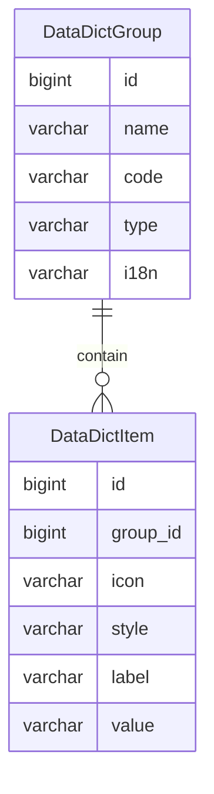

字典
====

字典是全局常量，在运行期间需要保持稳定不变，而对于一些特殊情况，也具备相应的灵活性。

---

## 设计思路

为此，需要设计两种方式的数据字典：

1. 内置数据字典：通常是枚举类，一般情况下不会修改和删除，每次系统启动时扫描并同步到数据库
2. 自定义数据字典：通常持久化到数据库，同步到缓存系统，支持运行时修改，通过管理后台更新

### 内置数据字典

首先，假设数据字典存储在数据库中，则全新环境下的第一次启动，可能应用还没有初始化数据库，如果需要数据字典来判断的话，则由于鸡生蛋、蛋生鸡的先后顺序问题而无法执行。

因此，我们将枚举作为内置数据字典，利用枚举的特性，可以确保通过 JPA 实体保存的数据具有强约束性，这将获得极高的稳定性。

另外，通过 Spring Data REST 框架（后续简称为 REST）可以将枚举值解析为基于 i18n 国际化消息的文本，完全不用担心可读性的问题。

### 自定义数据字典

如果只使用内置数据字典，则无法满足日新月异的需求，我们也不可能只因为添加数据字典枚举，而频繁地发布版本，所以必须为此增加灵活性——自定义数据字典。

自定义的数据字典，通过 JPA 实体关系进行引用，在开启查询缓存的前提下，根本无需额外设计针对数据字典的热缓存。

**待定：如果要支持 i18n 国际化消息，那么必须再实现一个自定义国际化消息模块，以配合自定义数据字典的国际化消息。**

## 数据建模

试着思考一下，当用户填写资料时，需要选择性别：男、女。

可以通过 `code=gender` 查询关键字获取 `未知[UNKNOWN]`、`男[MALE]`、`女[FEMALE]` 这三条字典数据，中括号里面是数值，外面是标签，这样方便前端展示。

常见的设计方案，是将数据字典作为一张表，通过 `parent` 字段嵌套父子关系，用于实现分类。

这个方案对于 JPA 框架的一对多嵌套关系来说不是很友好，且将冗余 `code` 字段，由于在此字段上定义了唯一约束，所以只能加大对应树结构的深度，于是就带来了可怕的复杂性。

如果将字典分类的类型单独作为一个字段，则在字典数据中存在大量的冗余数据，不但不利于建立索引，而且这种数据结构会误导其他开发人员。

基于以上种种问题，我们决定将数据字典拆分为两张表：数据字典组和数据字典项。

#### 数据字典组

通过名称、代码以及类型去定义字典组，查询时通过组代码确定唯一性，一般情况下，字典组包含多个字典项。

- name 名称：常用于页面展示
- code 代码：常用于查找，必须保证唯一
- type 类型：区分数据字典来源
    - INTERNAL：内置，通过扫描指定位置的枚举类生成
    - CUSTOMIZE：自定义，通过系统手动新增或修改
- i18n 国际化（可选）：保存自定义国际化消息 key 值，用于返回数据的国际化消息

#### 数据字典项

字典项采用 label-value 结构，方便前端展示，通过字典组可以获取所有同类型的字典项。

- group_id 字典组id
- icon 图标（可选），用于显示图标
- style 样式（可选），用于显示样式
- label 标签，用于查找及页面展示
- value 值，可以直接使用或存储

## 开发设计

由于内置数据字典是枚举类，开发人员一不小心就创建出相同含义的不同枚举类，比如逻辑状态就有：是与否，真与假，对与错等等。

这绝对是灾难性的一幕，并且是真实发生过的事情，直接导致项目变得十分混乱，团队中的每一个开发人员都吃尽了苦头。

为此，我们必须收集所有的数据字典相关的枚举类，在系统启动时，自动更新到数据库中，作为只读数据仅供查询。

这种方式可以很好地利用数据库的唯一性约束，提前在系统启动阶段识别出重复枚举，从而避免更多的开发人员陷入泥潭。

另外，对于自定义数据字典，则需要建立数据字典模块，提供基本的 CURD 功能，并且为了更好的性能考虑，需要引入相关缓存系统。

### 数据字典更新检测

仅针对内置数据字典，设定在系统启动时自动执行检测服务：

1. 首先根据枚举类字典的相关规则，获得所有枚举类的名称和值
2. 再根据枚举类的名称获取对应字典组数据，如果不存在则创建，已存在则获取实体数据
3. 根据字典组包含的字典项数据，与枚举类的值进行对比，如果不存在则创建，已存在则更新

### 数据字典模块

数据字典类型不同，所提供的功能也不一样：

- 内置数据字典：仅支持查询操作，系统启动自动执行更新检测
    - 查询：通过分组代码查询数据字典，自动得到所有相关的字典项，可以通过 分组代码 + 字典项值 确定唯一的数据字典对象
- 自定义数据字典：支持查询、新增、修改、删除、清空缓存、预热缓存操作
    - 查询：同上
    - 新增：支持新增字典组，若为指定字典组新增字典项时，使用字典组实体作为字典项的分组对象；需要校验是否已存在相同名称的字典项
    - 修改：支持修改字典组和字典项，支持修改字典项的所属分组，但必须检测字典项是否重复
    - 删除：支持字典组和字典项的单条删除、批量删除
    - 清空缓存：删除数据字典对应的所有缓存数据
    - 预热缓存：将数据库中已有的数据字典数据，全部加载到缓存