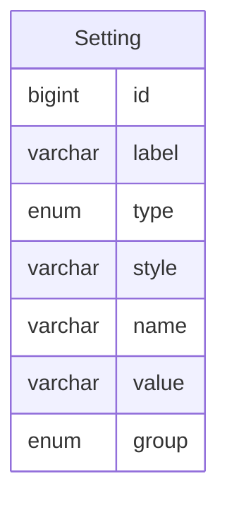

设置
====

遵循【约定大于配置】的理念，提供默认设置以开箱即用，同时可以在后台管理设置。

---

## 设计思路

一方面参考 `Spring properties` 的设计，一方面参考 `Redmine` 的管理后台配置。

可以配置的地方包括但不限于：

- 一般：网站标题、欢迎文字、网站作者、联系方式、版权声明、分页大小、日期格式、时间格式、日期时间格式、登录成功跳转地址、注销成功跳转地址
- 认证：认证开关、自动登录（30天）、自动注册、最短密码长度、密码规则、密码有效期、忘记密码开关、密码验证错误次数上限、密码验证失败冻结时长
- 文件：附件大小限制、允许上传的附件类型、禁止上传的附件类型、附件名称编码规则

设置数据属于热数据，需要在系统启动时，自动缓存数据，可以利用 `Spring Cache` 实现。

另外，当管理员从后台修改系统设置时，也可以利用 `Spring Cache` 对缓存进行同步。

## 数据建模

由于我们已经有字典，所以对于一般、认证、文件这些设置类型，可以保存在字典里，然后我们只需要一张设置表即可满足需求。

### 设置

- label 标签：用于表单元素的显示名称
- type 类型：用于确定表单类型，是输入框还是下拉选择框，亦或其他类型
- style 风格：用于确定当前设置展示的风格
- name 名称：用于表单元素的传参名称
- value 数值：用户操作的具体数值
- group 组：即当前设置所属分组

## 注意事项

设置与 `application.yaml` 文件配置完全是两种概念，开发时一定要注意边界问题。

- `Setting`
  - 灵活
  - 改动频繁
  - 不涉及框架
  - 纯粹的代码逻辑
- `application.yaml`
  - 固定
  - 不能改动
  - 与框架有关
  - 系统运行的必备参数

### 举例说明

比如在 `application.yaml` 中配置的数据库参数，就不适合修改，它和框架有关，更确切的说，它与数据库连接驱动有关，是系统运行的必备参数。

而设置参数一般是动态的数据，比如默认分页大小、日期格式、登录成功跳转地址等等。

所以我们现在可以很快找到这两者的边界，即设置是运行时规则，而 `application.yaml` 是程序参数。

**即：前者是系统运行过程中的配置项，后者是启动程序所需要的参数项。**