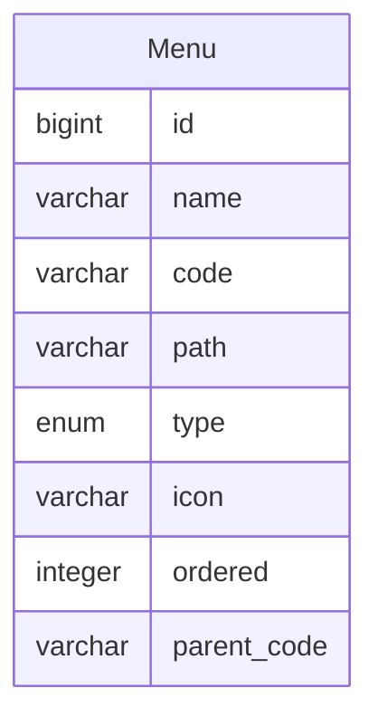

菜单
====

菜单分为导航栏菜单、侧边栏菜单和标签菜单，其中导航栏和侧边栏菜单有菜单分组和菜单项，用来增加菜单深度，标签菜单则是相同内容的不同分页。

为了方便开发，可以新建一个 @Menu 注解，用来标记属于菜单的接口，但这只适用于后端渲染的情况，比如 thymeleaf、jsp 等等。

如果是前后端分离的架构，那么菜单的访问权限由前端 route 控制，后端仅提供菜单数据，此时需要设计一个菜单管理功能，用来新增菜单数据存放到数据库，在前端需要时返回数据给前端。

---

## 导航栏菜单--nav

导航栏菜单通常表示一个大类，如首页、账号中心、系统管理等等。

## 侧边栏菜单--side

侧边栏菜单通常表示大类中的小类，比如：用户管理、角色管理、分组管理、授权管理、菜单管理等等。

## 标签菜单--tab

其他菜单通常表示小类对应内容中的标签菜单，比如考试管理中的考试列表，又分为英语考试、驾照考试等。

## 按钮菜单--button

按钮菜单通常是在内容中的各种操作按钮，比如英语考试中的新增、编辑、删除等。

## 数据建模

- name：名称，必填
- code：编码，必填
- path：路径，必填
- type：类型，nav 导航菜单、side 侧边栏菜单、tab 标签菜单、button 按钮菜单
- icon：图标
- ordered：排序
- parent_code：上级编号，若为 null 则表示顶级菜单
