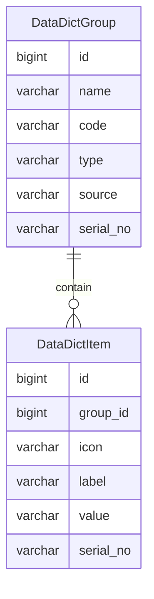

数据字典
=======

数据字典是固定数据，一般情况下不会发生变化，因此可以视为全局常量。

---

## 设计思路

数据字典是固定的分类数据。比如填写用户资料时，需要选择性别，通常可选的性别分类数据为：未知、男、女。

我们通过 `gender` 关键字获取 `未知[unknown]`、`男[male]`、`女[female]` 这三条字典数据，中括号里面是 value 数值，主要用于查询，外面是 label 标签，主要用于展示。

常见的设计思路是将数据字典作为一张数据表，通过 parent 字段嵌套父子关系，用于实现字典数据的分类。

在 Spring Data JPA 中，实现以上父子关系比较简单，但也带来了一些问题。

因为要保证字典分类的唯一性，则字典数据的 key 值必须以字典分类的 key 值为前缀，如果不这样设置前缀的话，将导致字典分类的唯一性受到极大限制——可用的 key 值范围变小。

即便用复合主键得以实现，后续定义父子关系（即一对多、多对一关系）也十分棘手，并且对于查询来说，非常不友好。

如果将字典分类的类型单独作为一个字段，则在字典数据中属于冗余字段，这种数据结构可能会误导开发者。

因此我们将数据字典拆分为两张表：数据字典组和数据字典项。

## 数据建模

### 数据字典组

通过名称、代码以及类型去定义字典组，查询时通过组代码确定唯一性，一般情况下，字典组包含多个字典项。

- name 名称：常用于页面展示
- code 代码：常用于查找，必须保证唯一
- type 类型：区分数据字典来源
    - DEFAULT：默认，从类路径 Excel 文件导入
    - DB：自定义，通过系统手动新增或修改
    - API：从第三方同步，比如城市列表、邮政编码、机构编码等
- source 数据源：需要明确的数据来源或操作人
    - DEFAULT：类路径上的 Excel 文件地址
    - DB：操作的用户名称
    - API：URL 路径，仅 GET 方式调用
- serial_no 序列号：用来确定字典项的基础版本，可用于还原及回滚操作

数据字典组 v1.0 示例：

| name  | code            | type | source                        | serial_no    |
|-------|-----------------|------|-------------------------------|--------------|
| 性别    | gender          |      | classpath:data/data-dict.xlsx | 202207271556 |
| 格式化模板 | format_template |      | classpath:data/data-dict.xlsx | 202207271556 |
| 序号模板  | serial_template |      | classpath:data/data-dict.xlsx | 202207271556 |
| 布尔状态  | boolean_status  |      | classpath:data/data-dict.xlsx | 202207271556 |
| 逻辑状态  | logic_status    |      | classpath:data/data-dict.xlsx | 202207271556 |
| 激活状态  | active_status   |      | classpath:data/data-dict.xlsx | 202207271556 |
| 开关状态  | switch_status   |      | classpath:data/data-dict.xlsx | 202207271556 |
| 启用状态  | enabled_status  |      | classpath:data/data-dict.xlsx | 202207271556 |
| 事件状态  | event_status    |      | classpath:data/data-dict.xlsx | 202207271556 |
| 任务状态  | task_status     |      | classpath:data/data-dict.xlsx | 202207271556 |

### 数据字典项

字典项采用 label-value 结构，方便前端展示，通过字典组可以获取所有同类型的字典项。

- group_id 字典组id
- icon 图标（可选），用于页面展示
- label 标签，用于查找及页面展示
- value 值，可以直接使用或存储

数据字典项 v1.0 示例：

| group（实际上是id）   | icon |    label |               value |  serial_no   |
|-----------------|------|---------:|--------------------:|:------------:|
| gender          |      |       未知 |             unknown | 202207271556 |
| gender          |      |        男 |                male | 202207271556 |
| gender          |      |        女 |              female | 202207271556 |
| format_template |      |     日期格式 |          yyyy-MM-dd | 202207271556 |
| format_template |      |     时间格式 |            HH:mm:ss | 202207271556 |
| format_template |      |   日期时间格式 | yyyy-MM-dd HH:mm:ss | 202207271556 |
| serial_template |      |     日期序号 |            yyyyMMdd | 202207271556 |
| serial_template |      |     时间序号 |              HHmmss | 202207271556 |
| serial_template |      |   日期时间序号 |      yyyyMMddHHmmss | 202207271556 |
| serial_template |      | 日期时间毫秒序号 |   yyyyMMddHHmmssSSS | 202207271556 |
| logic_status    |      |        否 |                   0 | 202207271556 |
| logic_status    |      |        是 |                   1 | 202207271556 |
| active_status   |      |       锁定 |                   0 | 202207271556 |
| active_status   |      |       激活 |                   1 | 202207271556 |
| switch_status   |      |       关闭 |                   0 | 202207271556 |
| switch_status   |      |       开启 |                   1 | 202207271556 |
| enabled_status  |      |       停用 |                   0 | 202207271556 |
| enabled_status  |      |       启用 |                   1 | 202207271556 |
| event_status    |      |      未开始 |                   0 | 202207271556 |
| event_status    |      |      进行中 |                   1 | 202207271556 |
| event_status    |      |      已完成 |                   2 | 202207271556 |
| task_status     |      |       默认 |                   0 | 202207271556 |
| task_status     |      |       预备 |                   2 | 202207271556 |
| task_status     |      |       运行 |                   3 | 202207271556 |
| task_status     |      |       成功 |                   4 | 202207271556 |
| task_status     |      |       失败 |                   5 | 202207271556 |

## 开发设计

前面提到，数据字典一般情况下不会发生变化，但也存在变化的情况，所以我们要做两部分设计。

其一，通过初始化任务从类路径读取指定 Excel 文件，生成数据字典的初始数据。

其二，创建后台管理的数据字典模块，支持手动管理数据库中的数据字典。

### 字典初始化

这个功能支持后台主动调用，因此会先清理所有数据字典表，再插入相关数据，属于全局的【重置】操作。

**思路扩展：是否每个大版本都将所有数据从数据库中导出为 Excel 文件，作为内置的数据字典初始化文件？**

如果是的话，则需要基于 POI 框架的设计导入导出功能，如果是自动化导入导出的话，则需要用模板映射导入导出的关系，而模板一般是用户上传到系统中，所以又需要一个附件上传功能以及附件管理模块。

这个扩展可以作为 v2.x 版本的开发计划。

### 字典模块

数据字典模块根据现有分组类型，分为三类字典项：

- 内置字典：支持查询、新增、修改、还原、回滚操作，不支持删除操作
    - 查询：当通过分组代码查询数据字典时，结果将包含所有的字典项，则必须按最新的日期时间序号进行去重
    - 新增：为指定字典组新增字典项时，使用字典组的序列号作为字典项的序列号，当检测到 label 相同时，不允许重复添加
    - 修改：不直接改变现有字典项，而是复制指定的字典项，修改相关内容后，以当前日期时间序列为版本号
    - 还原：如果字典项序列号与字典组序列号不同，则还原操作可用，将删除字典组下所有不匹配分组序列号的字典项
    - 回滚：如果字典项序列号与字典组序列号不同，则回滚操作可用，将根据字典项的序列号倒序显示列表，回滚指定字典项时，仅复制数据并设置序列号为当前日期时间序列
- 自定义字典：支持查询、新增、修改、删除、恢复操作，不支持还原操作（因为没有内置数据可依托）
    - 查询：当通过分组代码查询数据字典时，结果将包含所有的字典项，则必须按最新的日期时间序号进行去重，且必须对软删除的数据进行过滤
    - 新增：为指定字典组新增字典项时，使用字典组的序列号作为字典项的序列号，当检测到 label 相同且非软删除时，不允许重复添加
    - 修改：不直接改变现有字典项，而是复制指定的字典项，修改相关内容后，以当前日期时间序列为版本号
    - 删除：支持单条字典项删除、批量删除、分组删除，此删除方式是软删除，原有数据依然存在于数据库中
    - 恢复：支持单条字典项恢复、批量恢复、分组恢复，与删除操作相反，是将软删除字段置为 false
- 第三方字典：仅支持查询、同步操作，不支持新增、修改、还原、回滚、删除、恢复等其他操作
    - 查询：当通过分组代码查询数据字典时，结果将包含所有的字典项
    - 同步：按接口顺序，先删除接口相关的全部数据，随后根据结果重建字典组及字典项

字典的查询优先级：自定义字典 > 内置字典 > 第三方字典。

只有前者不存在对应字典组时，才从优先级低的后者寻找可用字典组，直到没有任何相关数据，返回 404 异常。

### 扩展