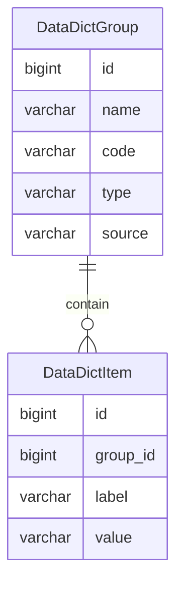

数据字典
=======

数据字典是固定数据，一般情况下不会发生变化，因此可以视为全局常量。

---

## 数据建模

由于 JPA 在设计实体的父子级嵌套时比较麻烦，即便用复合主键得以实现，后续定义一对多、多对一关系也十分棘手，因此这里拆分出来字典分组和字典项。

### 数据字典分组

- name 名称：常用于页面展示
- code 代码：常用于查找，必须保证唯一
- type 类型：区分数据字典来源
    - 默认（空）：从类路径 Excel 文件导入，每个大版本需要从数据库导出数据字典的数据，固定为 Excel 文件
    - DB：通过后台管理手动添加
    - API：从第三方获取的数据字典，比如城市列表、邮政编码、机构编码等
- source 数据源：根据类型从数据源解析字典项数据
    - 默认类型：类路径上的 Excel 文件地址
    - DB：添加的用户名称
    - API：URL 路径，仅 GET 方式调用

| name  | code            | type | source |
|-------|-----------------|------|--------|
| 性别    | gender          | DB   | admin  |
| 格式化模板 | format_template | DB   | admin  |
| 序号模板  | serial_template | DB   | admin  |
| 布尔状态  | boolean_status  | DB   | admin  |
| 激活状态  | active_status   | DB   | admin  |
| 开关状态  | switch_status   | DB   | admin  |
| 启用状态  | enabled_status  | DB   | admin  |
| 事件状态  | event_status    | DB   | admin  |
| 任务状态  | task_status     | DB   | admin  |

### 数据字典项

- group_id 字典分组id，表示字典项的类型
- label 标签，用于页面展示
- value 数值，用于查找，不要求唯一

| group（实际上是id）   | label    | value               |
|-----------------|----------|---------------------|
| gender          | 未知       | 0                   |
| gender          | 男        | 1                   |
| gender          | 女        | 2                   |
| format_template | 日期格式化    | yyyy-MM-dd          |
| format_template | 时间格式化    | HH:mm:ss            |
| format_template | 日期时间格式化  | yyyy-MM-dd HH:mm:ss |
| serial_template | 日期序号     | yyyyMMdd            |
| serial_template | 时间序号     | HHmmss              |
| serial_template | 日期时间序号   | yyyyMMddHHmmss      |
| serial_template | 日期时间毫秒序号 | yyyyMMddHHmmssSSS   |
| boolean_status  | 否        | 0                   |
| boolean_status  | 是        | 1                   |
| active_status   | 禁止       | 0                   |
| active_status   | 激活       | 1                   |
| switch_status   | 关闭       | 0                   |
| switch_status   | 开启       | 1                   |
| enabled_status  | 停用       | 0                   |
| enabled_status  | 启用       | 1                   |
| event_status    | 未执行      | 0                   |
| event_status    | 已完成      | 1                   |
| task_status     | 默认       | 0                   |
| task_status     | 预备       | 1                   |
| task_status     | 运行       | 2                   |
| task_status     | 成功       | 3                   |
| task_status     | 失败       | 4                   |
