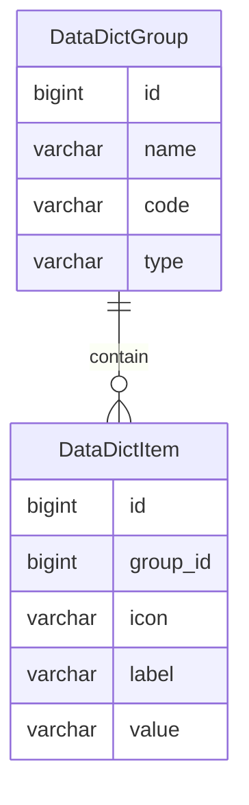

数据字典
=======

数据字典是固定数据，一般情况下不会发生变化，因此可以视为全局常量。

---

## 设计思路

数据字典是固定的分类数据。比如填写用户资料时，需要选择性别，通常可选的性别分类数据为：未知、男、女。

我们通过 `gender` 关键字获取 `未知[-1]`、`男[1]`、`女[0]` 这三条字典数据，中括号里面是 value 数值，主要用于查询和比较，外面是 label 标签，主要用于标签和展示。

常见的设计思路是将数据字典作为一张数据表，通过 parent 字段嵌套父子关系，用于实现字典数据的分类。

在 Spring Data JPA 中，实现以上父子关系比较简单，但也带来了一些问题。

因为要保证字典分类的唯一性，则字典数据的 key 值必须以字典分类的 key 值为前缀，如果不这样设置前缀的话，将导致字典分类的唯一性受到极大限制——可用的 key 值范围变小。

即便用复合主键得以实现，后续定义父子关系（即一对多、多对一关系）也十分棘手，并且对于查询来说，非常不友好。

如果将字典分类的类型单独作为一个字段，则在字典数据中属于冗余字段，这种数据结构可能会误导开发者。

因此我们将数据字典拆分为两张表：数据字典组和数据字典项。

## 数据建模

### 数据字典组

通过名称、代码以及类型去定义字典组，查询时通过组代码确定唯一性，一般情况下，字典组包含多个字典项。

- name 名称：常用于页面展示
- code 代码：常用于查找，必须保证唯一
- type 类型：区分数据字典来源
    - DEFAULT：默认，从类路径 Excel 文件导入
    - CUSTOMIZE：自定义，通过系统手动新增或修改

数据字典组 v1.1 示例：

| name | code     | type    |
|------|----------|---------|
| 性别   | gender   | DEFAULT |
| 是否   | logic    | DEFAULT |
| 答案   | answer   | DEFAULT |
| 激活   | active   | DEFAULT |
| 开关   | switch   | DEFAULT |
| 启用   | enabled  | DEFAULT |
| 事件   | event    | DEFAULT |
| 日程   | schedule | DEFAULT |
| 任务   | task     | DEFAULT |

### 数据字典项

字典项采用 label-value 结构，方便前端展示，通过字典组可以获取所有同类型的字典项。

- group_id 字典组id
- icon 图标（可选），用于页面展示
- label 标签，用于查找及页面展示
- value 值，可以直接使用或存储

数据字典项 v1.1 示例：

| group_code | icon | label | value |
|------------|------|------:|------:|
| gender     |      |    未知 |    -1 |
| gender     |      |     女 |     0 |
| gender     |      |     男 |     1 |
| logic      |      |     否 |     0 |
| logic      |      |     是 |     1 |
| answer     |      |    错误 |     0 |
| answer     |      |    正确 |     1 |
| active     |      |    锁定 |     0 |
| active     |      |    激活 |     1 |
| switch     |      |    关闭 |     0 |
| switch     |      |    开启 |     1 |
| enabled    |      |    停用 |     0 |
| enabled    |      |    启用 |     1 |
| event      |      |   未开始 |     0 |
| event      |      |   进行中 |     1 |
| event      |      |   已完成 |     2 |
| schedule   |      |  定时次数 |     0 |
| schedule   |      |  定期次数 |     1 |
| schedule   |      |  间隔次数 |     2 |
| schedule   |      |  定时重复 |     3 |
| schedule   |      |  定期重复 |     4 |
| schedule   |      |  间隔重复 |     5 |
| schedule   |      |  立即执行 |     6 |
| task       |      |    默认 |     0 |
| task       |      |    运行 |     1 |
| task       |      |    暂停 |     2 |
| task       |      |    成功 |     3 |
| task       |      |    失败 |     4 |

## 开发设计

前面提到，数据字典一般情况下不会发生变化，但也存在变化的情况，所以我们要做两部分设计。

其一，通过初始化任务从类路径读取指定 Excel 文件，生成数据字典的初始数据，这部分内容属于内置数据，不可通过后台修改，只能随着版本升级而变化。

其二，创建后台管理的数据字典模块，支持手动管理数据库中的数据字典，包括增删改查，除了内置数据，其他都可以被删除。

**思路扩展：对于手动管理的数据字典，实际上我们可以通过建立历史记录模块，来记录新增、修改、删除操作带来的变化，以提供回滚操作。**

### 字典初始化

这个功能支持后台主动调用，因此会先清理所有 DEFAULT 类型的数据字典表，再插入相关数据，属于对内置数据字典的【重置】操作。

**思路扩展：每个大版本都将所有数据从数据库中导出为 Excel 文件，作为内置的数据字典初始化文件。**

### 字典模块

数据字典模块根据现有分组类型，分为两类字典项：

- 内置字典：仅支持查询、重置操作
    - 查询：通过分组代码查询数据字典，自动得到所有相关的字典项，可以通过 分组代码 + 字典项值 确定唯一的数据字典对象
    - 重置：重新执行初始化流程，因此这个流程必须作为 service 独立出来，此操作是考虑数据库出现问题时，提供快速恢复机制
- 自定义字典：支持查询、新增、修改、删除操作，暂不支持历史记录查询和回滚操作
    - 查询：同上
    - 新增：支持直接新增字典组，若为指定字典组新增字典项时，使用字典组实体作为字典项的分组对象，当检测到 label 或 value 相同时，不允许重复添加
    - 修改：支持直接修改字典组和字典项，支持修改字典项的所属分组，但必须检测是否重复
    - 删除：支持单条字典项删除、批量删除，支持单条删除及批量删除字典组
