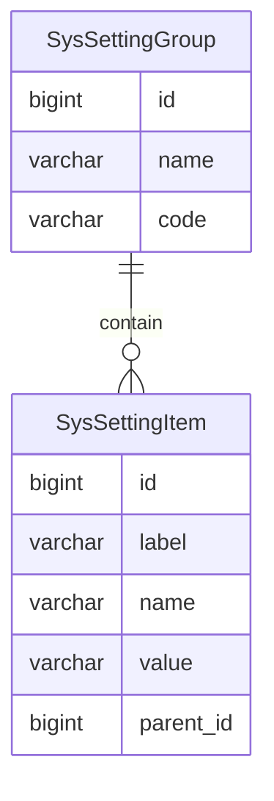

系统设置
======

系统设置遵循【约定大于配置】的理念，提供默认参数以开箱即用，同时可以通过后台统一管理。

---

## 设计思路

系统设置与数据字典在数据结构上非常相似，但它俩是完全不同的事物。

系统设置的灵感来自 Redmine 的管理后台配置，可以配置的地方包括（已剔除与本系统无关内容）：

- 一般：网站标题、欢迎文字、网站作者、联系方式、版权声明、分页大小、日期格式、时间格式、日期时间格式
- 认证：认证开关、自动登录（30天）、自动注册、最短密码长度、密码规则、密码有效期、忘记密码开关
- 文件：附件大小限制、允许上传的附件类型、禁止上传的附件类型、附件名称编码规则

其他设置则后续慢慢添加，暂时先根据以上内容丰富本系统。

## 数据建模

系统设置数据属于热数据，需要在系统启动时，自动加载一次，可以利用 Spring Cache 实现。

另外，当管理员从后台修改系统设置时，也可以利用 Spring Cache 对缓存进行 CURD 同步。

### 系统设置组

最简单的分组，通过一对多关系包含设置项列表。

- name 名称：用于显示系统设置的 tab 元素
- code 编码：用于确定 tab 元素的唯一性，所以这个字段不能重复

### 系统设置项

- label 标签：用于输入框、选择框等表单元素的显示名称
- name 名称：用于输入框、选择框等表单元素的传参名称
- value 数值：用户操作的具体数值
- parent_id 父级：设置组的 id

## 注意事项

系统设置与 `application.yaml` 文件配置完全是两种概念，开发时一定要注意边界问题。

- `SysSetting`
    - 灵活
    - 改动频繁
    - 不涉及框架
    - 纯粹的代码逻辑
- `application.yaml`
    - 固定
    - 不能改动
    - 与框架有关
    - 系统运行的必备参数

### 举例说明

比如在 `application.yaml` 中配置的数据库参数，就不适合灵活配置以及经常改动，它和框架有关，更确切的说，它与数据库连接驱动有关，是系统运行的必备参数。

而系统设置的参数一般是账号锁定时长，又或者是邮件配置，甚至是前端的网页标题。

所以我们现在可以很快找到这两者的边界，即系统设置是运行规则，而 `application.yaml` 是程序参数。

**前者是系统运行过程中的配置项，后者是启动程序所需要的参数项。**