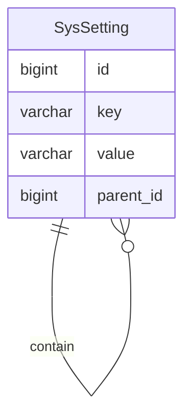

系统设置
======

系统设置遵循【约定大于配置】的理念，提供默认参数以开箱即用，通过 Redis 缓存保证快速刷新，全局生效，同时可以通过后台统一管理。

---

## 数据建模

系统设置的数据结构与数据字典非常相似，但其更新频率比数据字典高，因此需要独立出来进行数据建模。

### SysSetting

- key 键：manage、web、home、title
- value 值：管理后台、网页、首页、暗黑之门后台管理系统
- parent_id 父级：比如管理后台-网页-首页，作为 title 设置的父级

| id  | key    | value      | parent_id |
|-----|--------|------------|-----------|
| 1   | manage | 管理后台       | null      |
| 2   | web    | 网页         | 1         |
| 3   | home   | 首页         | 2         |
| 4   | title  | 暗黑之门后台管理系统 | 3         |

## 注意事项

系统设置与 `application.yaml` 文件配置完全是两种概念，开发时一定要注意边界问题。

- `SysSetting`
    - 灵活
    - 改动频繁
    - 不涉及框架
    - 纯粹的代码逻辑
- `application.yaml`
    - 固定
    - 不能改动
    - 与框架有关
    - 系统运行的必备参数

### 举例说明

比如在 `application.yaml` 中配置的数据库参数，就不适合灵活配置以及经常改动，它和框架有关，更确切的说，它与数据库连接驱动有关，是系统运行的必备参数。

而系统设置的参数一般是 hub 模块的账号锁定时长，又或者是 server 模块的运行规则，甚至是 manage 模块的网页标题。

所以我们现在可以很快找到这两者的边界，即系统设置是运行规则，而 `application.yaml` 是运行参数。

**前者是系统运行过程中的配置项，后者是系统启动过程中的配置项。**