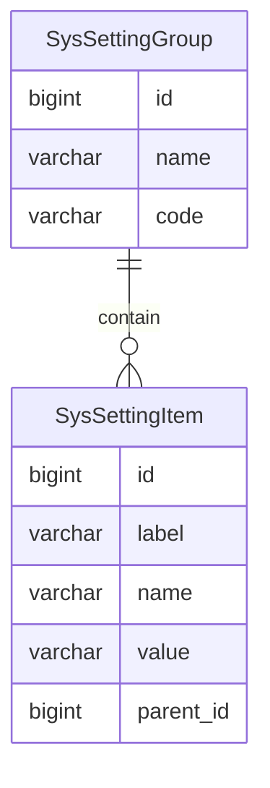

系统设置
======

系统设置遵循【约定大于配置】的理念，提供默认参数以开箱即用，通过 Redis 缓存保证快速刷新，全局生效，同时可以通过后台统一管理。

---

## 设计思路

系统设置与数据字典在数据结构上非常相似，但它俩是完全不同的事物。

系统设置的灵感来自 Redmine 的管理后台配置，可以配置的地方包括（已剔除与本系统无关内容）：

- 一般：网站标题、欢迎文字、网站作者、联系方式、版权声明、分页大小、日期格式、时间格式、日期时间格式
- 认证：认证开关、自动登录（30天）、自动注册、最短密码长度、密码规则、密码有效期、忘记密码开关
- 文件：附件大小限制、允许上传的附件类型、禁止上传的附件类型、附件名称编码规则

其他设置则后续慢慢添加，暂时先根据以上内容丰富本系统。

## 数据建模

### 系统设置组

最简单的分组，通过一对多关系包含设置项列表。

- name 名称：用于显示系统设置的 tab 元素
- code 编码：用于确定 tab 元素的唯一性，所以这个字段不能重复

系统设置组 v1.0 示例：

| id  | name | code         |
|-----|------|--------------|
| 1   | 一般   | general      |
| 2   | 认证   | authenticate |
| 3   | 文件   | file         |

### 系统设置项

- label 标签：用于输入框、选择框等表单元素的显示名称
- name 名称：用于输入框、选择框等表单元素的传参名称
- value 数值：用户操作的具体数值
- parent_id 父级：设置组的 id

系统设置项 v1.0 示例：

| id  | label     | name                | value                                                | parent_id |
|-----|-----------|---------------------|------------------------------------------------------|-----------|
| 1   | 网站标题      | title               | 行舟在线考试系统                                             | 1         |
| 2   | 欢迎文字      | welcome             | 欢迎来到行舟在线考试系统                                         | 1         |
| 3   | 网站作者      | author              | mrzhqiang                                            | 1         |
| 4   | 联系方式      | contact             | 287431404@qq.com                                     | 1         |
| 5   | 版权声明      | copy-right          | Powered by Rowing © 2022-2022 mrzhqiang              | 1         |
| 6   | 分页大小      | page-size           | 10                                                   | 1         |
| 7   | 日期格式      | date-format         | yyyy-MM-dd                                           | 1         |
| 8   | 时间格式      | time-format         | HH:mm:ss                                             | 1         |
| 9   | 日期时间格式    | date-time-format    | yyyy-MM-dd HH:mm:ss                                  | 1         |
| 10  | 认证开关      | auth-switch         | true                                                 | 2         |
| 11  | 自动登录      | remember-me         | 禁止 7 天 15 天 30 天 半年 365 天 永久 | 2         |
| 12  | 自动注册      | auto-register       | false                                                | 2         |
| 13  | 最短密码长度    | min-password-length | 6                                                    | 2         |
| 14  | 密码规则      | password-regulation | 数字 大写字母 小写字母 特殊字符 注意：以上为多选框          | 2         |
| 15  | 密码有效期     | password-expire     | 永久 1个月 3个月 6个月 1年                    | 2         |
| 16  | 忘记密码      | password-forget     | true                                                 | 2         |
| 17  | 附件大小      | attachment-size     | 100kb                                                | 3         |
| 18  | 允许上传的附件类型 | upload-whitelist    | jpeg png docx xlsx                       | 3         |
| 19  | 禁止上传的附件类型 | upload-blacklist    | mp3 mp4 rmvb avi                         | 3         |
| 20  | 附件名称编码规则  | name-regulation     | `[filename]`-yyyyMMddHHmmss                          | 3         |

## 注意事项

系统设置与 `application.yaml` 文件配置完全是两种概念，开发时一定要注意边界问题。

- `SysSetting`
    - 灵活
    - 改动频繁
    - 不涉及框架
    - 纯粹的代码逻辑
- `application.yaml`
    - 固定
    - 不能改动
    - 与框架有关
    - 系统运行的必备参数

### 举例说明

比如在 `application.yaml` 中配置的数据库参数，就不适合灵活配置以及经常改动，它和框架有关，更确切的说，它与数据库连接驱动有关，是系统运行的必备参数。

而系统设置的参数一般是账号锁定时长，又或者是邮件配置，甚至是前端的网页标题。

所以我们现在可以很快找到这两者的边界，即系统设置是运行规则，而 `application.yaml` 是程序参数。

**前者是系统运行过程中的配置项，后者是启动程序所需要的参数项。**