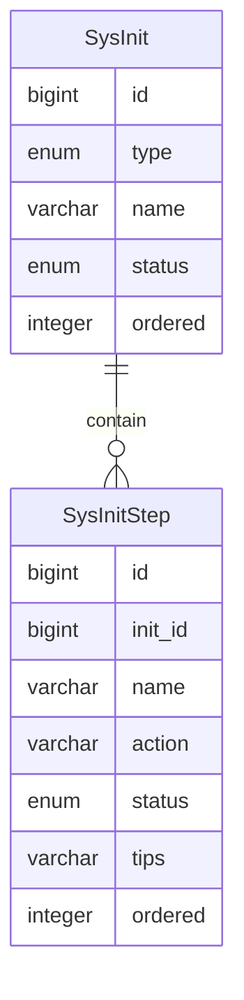

系统初始化
========

系统初始化分为两类：必选初始化、可选初始化。

必选初始化是在系统启动时自动执行，可选初始化是在访问系统时由用户决定是否执行。

必选初始化通常由初始化检测器在系统启动时，自动将相关实现加入到数据库，以记录初始化状态等信息。

可选初始化的数据由必选初始化提供。

**注意：可选初始化通过初始化菜单可重复打开页面执行相关操作。**

---

## 功能逻辑

使用文字简单地描述功能的逻辑流程。

### 必选初始化

1. 执行 `SysInitChecker` 检测是否存在初始化数据，如果不存在，则生成初始化数据；如果已存在，则跳过生成
2. 获取 sys_init 表中所有状态为未完成的数据，如果有则执行第三步，否则结束初始化
3. 检测类型为 1 的必选初始化数据是否存在
    1. 存在，根据名称生成 `AutoInitializer` 接口的对应扩展类，执行相关初始化步骤
        1. `DictAutoInitializer`
        2. `SettingAutoInitializer`
        2. `SysInitAutoInitializer`
    2. 不存在，结束初始化流程，正常启动应用

### 可选初始化

1. 访问首页时，检测是否执行过初始化操作
    1. 执行过，结束可选初始化流程，正常进入首页
    2. 未执行，重定向到可选初始化页面
2. 进入可选初始化页面时，先获取 sys_init 表中所有状态为未完成的数据
    1. 数据存在，执行第三步
    2. 数据不存在，结束初始化，展示初始化状态
3. 检测数据类型为 0 的可选初始化数据是否存在
    1. 存在，根据数据包含的初始化步骤，显示对应的页面并根据用户输入执行对应的操作
    2. 不存在，结束初始化，展示初始化状态

## 参考文档

1. [数据字典文档](../common/1.data-dict.md)
2. [系统设置文档](../common/2.sys-setting.md)

## 数据建模

### SysInit

| 字段名     | 注释  | 类型      | 长度  | 备注        |
|---------|-----|---------|-----|-----------|
| id      | ID  | bigint  |     | 主键、自增     |
| type    | 类型  | enum    | 10  | 0 可选 1 必须 |
| name    | 名称  | varchar | 32  | 非空、唯一     |
| status  | 状态  | enum    | 10  | 0 默认 1 完成 |
| ordered | 顺序  | integer | 10  | 从 0 开始、升序 |

### SysInitStep

| 字段名     | 注释     | 类型       | 长度  | 备注                                  |
|---------|--------|----------|-----|-------------------------------------|
| id      | ID     | bigint   |     | 主键、自增                               |
| init_id | 初始化 ID | bigint   |     | 非空、外键关联、多对一                         |
| name    | 名称     | varchar  | 32  | 非空、页面标题                             |
| path    | 模板路径   | varchar  | 64  | 导航到表单页面                             |
| action  | 表单地址   | varchar  | 255 | 后端接口接收表单数据                          |
| status  | 状态     | smallint | 1   | 0 未开始（默认） 1 进行中 2 已完成 3 失败 |
| tips    | 提示     | varchar  | 255 | 失败提示，帮助解决问题。 一般是 `i18n` 消息 key 值 |
| ordered | 顺序     | integer  | 10  | 从 0 开始、升序                           |
