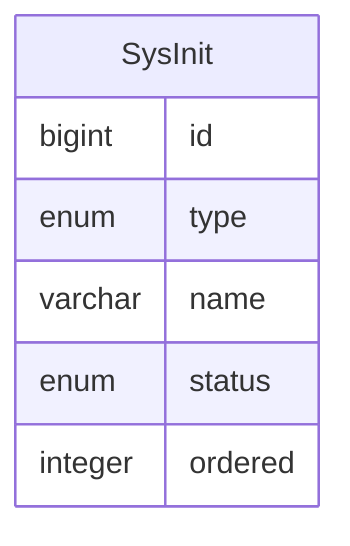

系统初始化
========

系统初始化是在系统启动时自动执行，通常由初始化检测器在系统启动时，自动将实现类的数据加入到数据库，以记录初始化状态等信息。

**注意：执行顺序可以通过相关注册器进行注册，对于未注册的初始化类，则以不确定顺序在已注册的初始化类之前执行。**

---

## 设计思路

系统启动时执行：

1. `AutoInitializationCheckRunner`：检测是否存在未生成的初始化数据，如果是，则生成初始化数据；否则完成检测
2. 按 `AutoInitializationOrderRegistration` 的注册顺序，执行以下自动初始化器：
    1. `DataDictAutoInitializer`
    2. `SysSettingAutoInitializer`
    3. `AccountAutoInitializer`
    4. `MenuAutoInitializer`
    5. 未完待续

## 数据建模

### 系统初始化

- type 类型：必选初始化是系统启动时自动执行的初始化任务；可选初始化是由管理后台决定是否执行的初始化任务
- name 名称：初始化任务实现类的全限定名称，用于保证每个初始化任务的唯一性
- status 状态：记录初始化任务的状态，避免系统启动时重复执行
- ordered 顺序：保证初始化任务按照设定的顺序执行

| 字段名     | 注释  | 类型      | 长度  | 备注                     |
|---------|-----|---------|-----|------------------------|
| id      | ID  | bigint  |     | 主键、自增                  |
| type    | 类型  | enum    | 10  | REQUIRE 必选、OPTIONAL 可选 |
| name    | 名称  | varchar | 32  | 非空、唯一                  |
| status  | 状态  | enum    | 10  | DEFAULT 默认 FINISHED 完成 |
| ordered | 顺序  | integer | 10  | 执行顺序                   |
