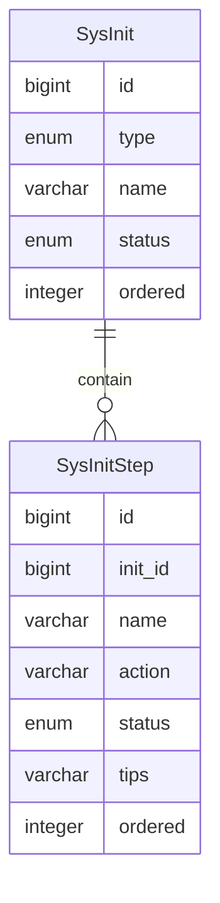

系统初始化
========

系统初始化分为两类：必选初始化、可选初始化。

必选初始化是在系统启动时自动执行，可选初始化是在访问系统时由用户决定是否执行。

必选初始化通常由初始化检测器在系统启动时，自动将相关实现加入到数据库，以记录初始化状态等信息。

可选初始化的数据由必选初始化提供。

**注意：可选初始化通过初始化菜单可重复打开页面执行相关操作。**

---

## 功能逻辑

使用文字简单地描述功能的逻辑流程。

### 必选初始化

1. 执行 `AutoInitializationCheckRunner` 检测是否存在未生成的初始化数据，如果是，则生成初始化数据；否则完成检测
2. 按 `AutoInitializationOrderRegistration` 的注册顺序，执行以下自动初始化器，检测是否已完成对应任务，如果已完成，则忽略
    1. `DataDictAutoInitializer`
    2. `SysSettingAutoInitializer`
    3. `AccountAutoInitializer`
    4. `MenuAutoInitializer`

### 可选初始化

1. 前端访问首页时，调用接口检测是否执行过初始化操作
    1. 执行过，正常进入首页
    2. 未执行，重定向到可选初始化页面
2. 进入可选初始化页面时，先获取所有状态为未完成的可选初始化数据
    1. 数据存在，根据对应类型执行对应初始化操作
    2. 数据不存在，展示可选初始化的状态列表

## 数据建模

### 系统初始化

| 字段名     | 注释  | 类型      | 长度  | 备注        |
|---------|-----|---------|-----|-----------|
| id      | ID  | bigint  |     | 主键、自增     |
| type    | 类型  | enum    | 10  | 0 可选 1 必须 |
| name    | 名称  | varchar | 32  | 非空、唯一     |
| status  | 状态  | enum    | 10  | 0 默认 1 完成 |
| ordered | 顺序  | integer | 10  | 执行顺序      |

### 系统初始化步骤

| 字段名     | 注释     | 类型      | 长度  | 备注                                  |
|---------|--------|---------|-----|-------------------------------------|
| id      | ID     | bigint  |     | 主键、自增                               |
| init_id | 初始化 ID | bigint  |     | 非空、外键关联、多对一                         |
| name    | 名称     | varchar | 32  | 非空、页面标题                             |
| path    | 模板路径   | varchar | 64  | 导航到表单页面                             |
| action  | 表单地址   | varchar | 255 | 后端接口接收表单数据                          |
| status  | 状态     | enum    | 1   | 0 未开始（默认） 1 进行中 2 已完成 3 失败 |
| tips    | 提示     | varchar | 255 | 失败提示，帮助解决问题。                        |
| ordered | 顺序     | integer | 10  | 执行顺序                                |
